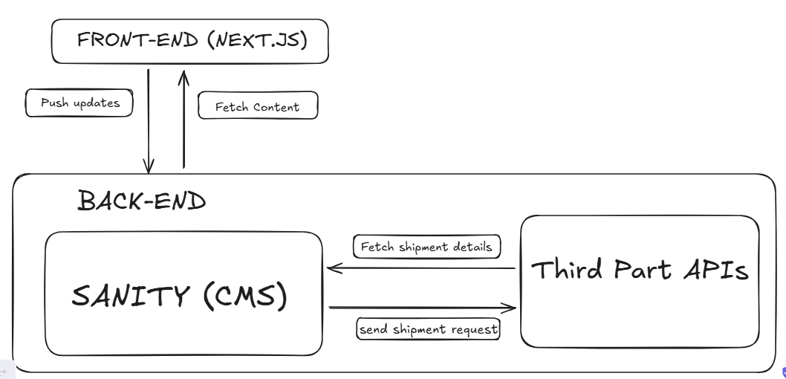

# System Architecture Overview

## Front-end interaction with Sanity CMS and Third Party APIs
The image below shows visual representation of how each component in my system interact with each other. 

## Role of Each Component
### 1. Front-End
- It displays data like products, or order info by fetching data from the backend.
- Handles actions like users clicking on “Place Order”.

### 2. Back-End
- It cordinates all the logics.
- It sends and receives requests from:
  1. Sanity CMS for content (product listings, user profiles, etc.).
  2. Logistics API for delivery updates (e.g., delivery partner gets order details).
  3. Payment API for payment validation and processing.
- It returns processed data to the frontend.

### 3. Sanity
- It structured as schemas.
- It allows your backend to fetch or update content easily via APIs.

### 4. Logistics API (Third-Party)
- When a user places an order, backend sends delivery details (address, product info) to the logistics API.
- Returns delivery updates to the backend (e.g., order dispatched, out for delivery, etc.), which then sends them to the frontend for users.

### 5. Payment API (Third-Party)
- When a user places an order, the payment API validates the credit card/payment info.
- Sends back confirmation to the backend and logs the payment in the system.

# Key Workflows
### 1. Content Fetching (User Browses the Marketplace)
User view products > Frontend requests product > Backend retrieves content from Sanity CMS > Frontend displays the fetched content to the user.

### 2. Order Placement
User clicks 'Order Now' in the frontend > Frontend sends order details to the backend > Backend actions sends order data to Sanity CMS for storage, creates a shipment via Logistics API (returns tracking ID) and processes payment via Payment API > Frontend confirms the order and displays the tracking ID.

### 3. Order Tracking
User clicks Track My Order in the frontend > Frontend sends tracking request to backend >Backend fetches status from Logistics API (e.g., "Out for delivery") > Frontend displays shipment status to the user.

# Plan API Requirements
Following are the API Endpoints I have planned:

### 1.	Products 
- Endpoint Name: /products
- Method: GET
- Description: Fetch all available products from the Sanity CMS.
- Response: Returns product details (ID, name, price, category, quantity, reviews).
  
### 2.	Single Product Details 
- Endpoint Name: /products/:id 
- Method: GET 
- Description: Fetch details of a single product by its ID. 
- Parameters: Product ID. 
- Response: Returns specific product details (ID, name, price, category, quantity, reviews). 

### 3.	Create an Order 
- Endpoint Name: /orders 
- Method: POST 
- Description: Create a new order in the system. 
- Payload: { "customerId": "12345", "products": [ { "id": "prod001", "quantity": 2 }, { "id": "prod002", "quantity": 1 } ], "totalAmount": 1000, "paymentMethod": "CreditCard", "deliveryZoneId": "zone001" } 
- Response: Returns order details (ID, status, createdAt, tracking ID).

### 4.	Fetch All Orders 
- Endpoint Name: /orders 
- Method: GET 
- Description: Fetch all orders. 
- Response: Returns a list of all orders with details (ID, total amount, status, createdAt). 

### 5.	Fetch a Single Order
- Endpoint Name: /orders/:id 
- Method: GET 
- Description: Fetch details of a specific order by its ID. 
- Parameters: Order ID. 
- Response: Returns specific order details (ID, products, customer info, total amount, status, shipment ID).

### 6.	Order Status 
- Endpoint Name: /orders/:id/status 
- Method: GET 
- Description: Fetch the status of an order by its ID. 
- Parameters: Order ID. 
- Response: { "orderId": "order001", "status": "Out for delivery", "shipmentId": "shipment001" } 

### 7.	Create a Payment 
- Endpoint Name: /payments 
- Method: POST 
- Description: Process a new payment. 
- Payload: { "orderId": "order001", "paymentMethod": "CreditCard", "amountPaid": 1000 } Response: Payment confirmation (ID, order ID, status). 

### 8.	Shipment Details 
- Endpoint Name: /shipments/:id 
- Method: GET 
- Description: Fetch details of a specific shipment by its tracking ID. 
- Parameters: Shipment ID. 
- Response: { "shipmentId": "shipment001", "deliveryTime": "2025-01-20T12:00:00Z", "status": "Out for delivery" } 

### 9.	Fetch Delivery Zones 
- Endpoint Name: /delivery-zones 
- Method: GET 
- Description: Fetch all delivery zones. 
- Response: Returns details of all zones (ID, zone name, delivery charges). 

### 10.	Customer Information 
- Endpoint Name: /customers/:id 
- Method: GET 
- Description: Fetch details of a customer by their ID. 
- Parameters: Customer ID. 
- Response: Customer details (ID, name, phone number, delivery zone ID). 

### 11.	Order Tracking 
- Endpoint Name: /orders/:id/tracking 
- Method: GET 
- Description: Fetch the current tracking status of an order. 
- Parameters: Order ID. 
- Response: { "orderId": "order001", "shipmentStatus": "Out for delivery", "estimatedDeliveryTime": "2025-01-20T15:30:00Z" } 

### 12.	Update Order Status 
- Endpoint Name: /orders/:id/status 
- Method: PATCH 
- Description: Update the status of an order (e.g., "Delivered", "Cancelled"). 
- Payload: { "status": "Delivered" } Response: Confirmation of status update. 

### 13.	Update Product Inventory 
- Endpoint Name: /products/:id/inventory 
- Method: PATCH 
- Description: Update the inventory of a specific product. 
- Payload: { "quantity": 10 } 
- Response: Confirmation of inventory update.

